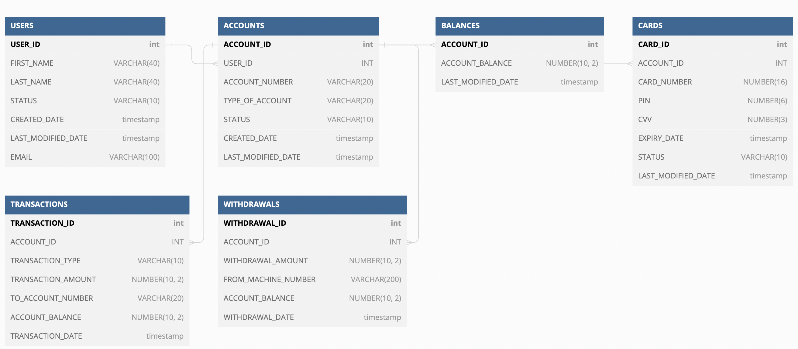
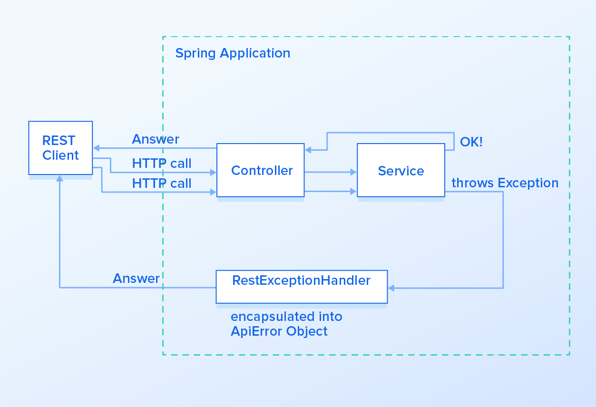

<!-- GETTING STARTED -->
## Getting Started

# Account Information Service

Account Information Services contains REST APIs related to users, accounts , balances, cards , transactions and withdrawals


# Which are not implemented (out of scope): 
* Authentication & Authorizations
* Deployment


### Prerequisites to run the application

* Configure application.yml 
* The default application.yml uses H2 database 

### Installation

1. Install Java19 & Maven3.8.6
2. Clone the repo
   ```sh
   git clone https://github.com/ltadiko/AccountInformation.git
   ```
3. mvn package
   ```sh
   * Run nl.rabo.accountinformation.AccountInformationApplication class as java application from IDE
    or
   * mvn compile exec:java -Dexec.mainClass=nl.rabo.accountinformation.AccountInformationApplication
    or
   * docker build --quiet --build-arg ENVIRONMENT=local --tag latest .
   * docker run -d -p 8080:8080 latest 
      ```

### Test API using postman

* Import Postman collection (AISP_APIs_Postman_collection.json) in postman

### Things could be done 

* Create more POJOs to separate entity models in Presentation layer
* Adding REST links to each resource
* Real Business validation on user status, card status...etc
* Improve Test coverage
* Mvc test cases for different HTTP codes
* Implementing pipeline


<!-- CONTACT -->
## Contact

Your Name - Lakshmaiah Tatikonda  - tlaxman88@gmail.com

Project Link: https://github.com/ltadiko/AccountInformation.git] (https://github.com/ltadiko/)

<p align="right">(<a href="#readme-top">back to top</a>)</p>


### API Swagger documentation

* Link to API documentation (http://localhost:8080/swagger-ui/#/)
* Link to generated swagger file http://localhost:8080/v2/api-docs

### DATABASE

* Application uses in-memory h2 store (http://localhost:8080//h2-console)
* Table queries and Initial data setup queries are mentioned in schema.sql
  
  

### Exception Handling

